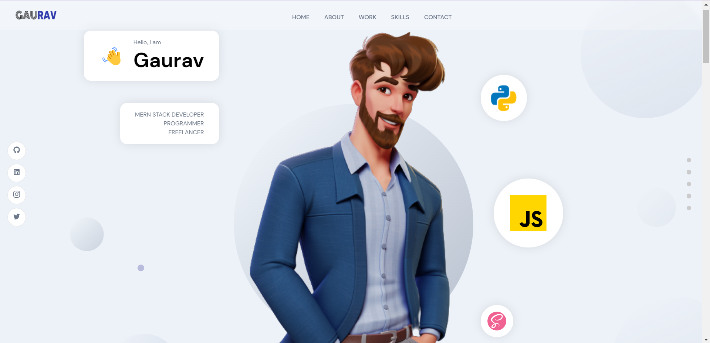

# My Stunning Portfolio Website

Welcome to my stunning portfolio website! This website showcases my work, skills, and achievements in a visually appealing and user-friendly manner. It is built using React.js, Sass, and Sanity CMS for the backend.

    

## Table of Contents
- [Introduction](#introduction)
- [Features](#features)
- [Technologies Used](#technologies-used)
- [Installation](#installation)
- [Usage](#usage)
- [Contributing](#contributing)
- [License](#license)

## Introduction

This portfolio website is designed to provide visitors with an immersive experience, highlighting my projects, skills, and expertise. Its clean and modern design, along with smooth animations, creates an engaging and visually stunning presentation.

## Features

- **Responsive Design:** The website is fully responsive and adapts seamlessly to different screen sizes, ensuring optimal viewing experience on desktops, tablets, and mobile devices.
- **Project Showcase:** A dedicated section to showcase my projects, including descriptions, images, and links to live demos or repositories.
- **Skills and Expertise:** Highlighting my skills and areas of expertise, allowing visitors to get a comprehensive understanding of my capabilities.
- **Contact Form:** A contact form to enable visitors to get in touch with me easily. The form securely captures user inputs and sends them to the desired email address.
- **Backend Powered by Sanity:** The website's content management system (CMS) is powered by Sanity, providing a flexible and easy-to-use backend for managing projects, skills, and other dynamic content.

## Technologies Used

- React.js: A popular JavaScript library for building user interfaces, providing a rich and efficient component-based architecture.
- Sass: A CSS preprocessor that enables the use of variables, mixins, and other advanced CSS features, making styling more manageable and maintainable.
- Sanity: A headless CMS that allows for content modeling, editing, and publishing, providing a robust backend for managing dynamic content.

## Installation

To run the portfolio website locally, follow these steps:

1. Clone the repository: `git clone [repository_url]`
2. Navigate to the project directory: `cd my-stunning-portfolio-website`
3. Install the dependencies: `npm install`

## Usage

To start the development server and view the website locally, run the following command:

The website will be accessible at `http://localhost:3000` in your web browser.

## Contributing

Contributions to this portfolio website are welcome! If you find any bugs or have suggestions for improvements, please feel free to open an issue or submit a pull request.

## License

This project is licensed under the [MIT License](LICENSE). Feel free to use, modify, and distribute the code as per the terms of the license.

The website will be accessible at `http://localhost:3000` in your web browser.

## Contributing

Contributions to this portfolio website are welcome! If you find any bugs or have suggestions for improvements, please feel free to open an issue or submit a pull request.

## License

This project is licensed under the [MIT License](LICENSE). Feel free to use, modify, and distribute the code as per the terms of the license.
